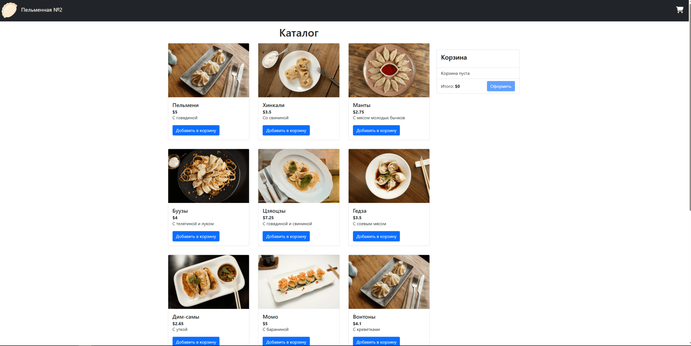
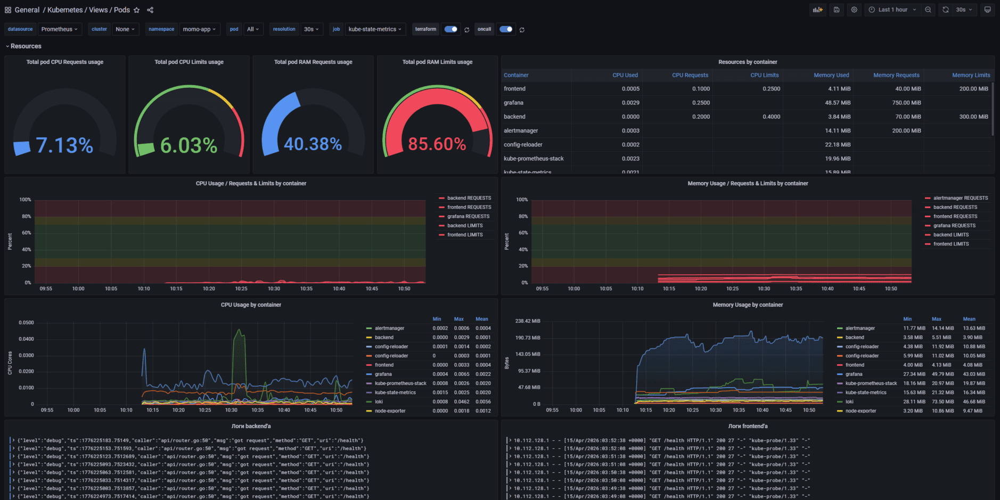

# Momo Store aka Пельменная №2



### Frontend

Представляет из себя nginx со статикой на vue.js и typescript, а также 3 api-endpoint'а, проксирующиеся на backend:
- /auth
- /momo-store/products
- /momo-store/categories

### Backend

Демонстрационное go-приложение пельменного магазина. Компилируется в бинарник и запускается на чистом alpine от пользователя `momouser`.  
Приложение сильное и независимое, а поэтому не нуждается в конфигурации, базе данных, и прочих атрибутах хорошей жизни. Оно слушает запросы на 8081 порту

## Презентация проекта
Если ваша зарплата оканчивается шестью нулями и вы не понимаете что тут написано и где картинки, или если вы наставник, проверяющий работу - вас ждёт презентация
[](/assets/presentation.pdf)

## Структура репозитория 
- `/backend`/`/frontend` - директории с исходным кодом, инструкциями и пайплайнами сборки и шаблонами чартов для backend'а и frontend'а соответственно
- `/infra` - директория с манифестами описывающими инфраструктуру кластера и сам кластер, а также пайплайнами для автоматического применения.
  - `/infra/cluster` - манифесты terraform для создания кластера и сопутствующих ресурсов
  - `/infra/token` - манифест k8s описывающий сервисный аккаунт кластера для деплоя приложения
  - `/infra/ingress`/`/infra/cert-manager` - пайпы применения чартов nginx-ingress и cert-manager и манифест k8s для clusterissuer
  - `/infra/monitoring` - манифесты всех инструментов мониторинга
    - `/infra/monigoring/grafana` - локальный чарт для установки grafana с кастомным путём root-директории
    - `/infra/monitoring/kube-prometheus-stack` - пайп установки чарта с prometheus и k8s экстрактора из удаленного репозитория
    - `/infra/monitoring/loki-stack` - пайп установки чарта с loki и promtail из удаленного репозитория
- `/assets` - директория с изображениями для readme

## Требования для установки
- Gitlab с раннерами
- Nexus helm-репозиторий
- 2 S3-бакета - для хранения state-файла terraform и изображений продуктов
- Yandex cloud аккаунт.
- Рабочий интернет.

## Terraform configuration

Перед конфигурацией необходимо вручную создать несколько облачных ресурсов, а именно:
- 2 сервисных аккаунта с ролями editor/admin, авторизованный ключ на аккаунте с ролью admin и статический на аккаунте с ролью editor.
- Бакет хранения состояния .tfstate

Для создания ресурсов необходимо указать переменные окружения проекта:
- AWS_ACCESS_KEY_ID - ID статичного ключа сервисного аккаунта с ролью editor для доступа к бакету хранения состояния tfstate
- AWS_SECRET_ACCESS_KEY - Секретный ключ для тех-же целей ^^^
- TERRAFORMRC_B64 - Закодированный в Base64 конфиг terraformrc с указанием зеркала для загрузки провайдера yandex cloud
- TF_KEY_B64 - Закодированный в Base64 json авторизованного ключа для сервисного аккаунта с ролью admin. Через него производится создание и настройка ресурсов. Роль admin здесь нужна для создания служебных (кластерных )сервисных аккаунтов и назначения им ролей
- TF_VAR_cloud_id - ID облака yandex cloud
- TF_VAR_folder_id - ID каталога yandex cloud

При изменении манифестов ресурсов, описанных в репозитории, автоматически запустится пайп по применению изменений.  
Destroy-пайп запускается отдельно, и требует успешно завершённого пайпа создания кластера. Простыми словами - чтобы что-то удалить, надо что-то создать.

## K8s configuration

### Конфигурация доступов

Для первичной конфигурации ресурсов нужен сервисный аккаунт с ролью cluster-admin.

```bash
kubectl create serviceaccount admin-user -n kube-system

kubectl create clusterrolebinding admin-binding \
  --clusterrole=cluster-admin \
  --serviceaccount=kube-system:admin-user

kubectl create token admin-user -n kube-system
```

Полученный токен используем для создания kubeconfig, кодируем конфиг в B64 и кладём в переменную окружения `ADMIN_KUBECONFIG_B64`.  
Затем можно запускать пайп `token` для создания токена доступа для приложения, создать на его основе kubeconfig, закодировать в Base64 и сложить в переменную окружения `KUBE_CONFIG_B64`.

### Установка ingress-контроллера и cert manager

Для установки понадобится установленная переменная окружения `ADMIN_KUBECONFIG_B64` из шага выше ^^^  
А также переменная окружения `INGRESS_HOST`, содержащая домен, ведущий на внешний IP ingress-контроллера.

Установка запускается вручную в веб-интерфейсе gitlab.  

Модульный пайплайн `ingress` подключит репозиторий ingress-nginx и установит helm-чарт в кластер.  
А пайплайн `cert` установит чарт cert-manager и создаст ресурс cluster issuer для обработки запросов на создание сертификатов.

### Установка мониторинга

Для этого есть модульный пайплайн monitoring. Он установит чарты loki-stack и prom-kube-stack, а также локальный чарт grafana.  

Для экономии средств (а ещё чтобы не выкладывать свой паспорт в интернет при покупке нормального домена) - мониторинг для доступа использует основной фронтэнд приложения.  
Графана будет доступна на `https://${INGRESS_HOST}/grafana-vxbor4`. Почему не просто `/grafana`? Чтобы пользователям (и сканерам) было чуть сложнее случайно зайти в панель мониторинга.  

Остаётся только подключить источники данных - `loki:3100` и `http://kube-prometheus-kube-prome-prometheus:9090`, и сконфигурировать дашборды. За основу брался дашборд с https://grafana.com/grafana/dashboards с id `15760`. Пример см. ниже



## Порядок установки

Некоторые компоненты зависимы от других, поэтому установку приложения нужно проводить в следующем порядке:
1. Конфигурация терраформа, запуск пайпа `cluster`;
2. Установка ingress-контроллера, запуск пайпов `ingress` и `cert`;
3. Установка стэка мониторинга, запуск пайпа `monitoring`;
4. Деплой фронта и бэкэнда приложения. Пайплайны сборки и деплоя будут запускаться при любых изменениях в соответствующих директориях.  

Поздравляю, вы великолепны. Приложение пельменной запущено, и доступно по указанному в `INGRESS_HOST` домену.

## Релизный цикл и версионирование

Версия приложения формируется как `1.0.${CI_PIPELINE_ID}`

- **feat/*** ветки — новая функциональность
- **fix/*** ветки — исправление багов
- Автоматически собираются и публикуются:
  - Docker-образы с тегом `1.0.${CI_PIPELINE_ID}`
  - Helm-чарты с версией `1.0.${CI_PIPELINE_ID}`

## Как понять, что всё окей? aka диагностика проблем

После успешной отработки всех пайплайнов приложение будет доступно по домену, указанному в `INGRESS_HOST`.  
Не доступно? Бывает, переходите к диагностике. Для доступа к кластеру на время дебага не стесняйтесь использовать `ADMIN_KUBECONFIG_B64`.
1. Проверьте состояние пайпов, если один из них упал - проверьте сообщения об ошибке. Если в ошибке ничего не понятно - повторно запустите пайплайн.
2. Проверьте созданные ресурсы - `kubectl get po,certificate,svc,ingress -n momo-app -o wide`. Убедитесь что у ingress имеется внешний адрес, certificate создан и у него указан секрет, а все поды в статусе Running.
3. Нашли проблемный ресурс? `kubectl describe type/name` и `kubectl logs type/name` в помощь.
4. Всё работает на компьютере у друга, но не у вас? Почистите кэш браузера.
5. Если ничего не помогло - значит сегодня не ваш день, попробуйте ещё раз завтра, или позовите системного администратора.

## Все переменные окружения проекта
| Переменная | Назначение |
|-------------|----------|
| `KUBE_CONFIG_B64` | Кодированный в B64 конфиг k8s юзера `momo-user` в namespace `momo-app` |
| `ADMIN_KUBECONFIG_B64` | Кодированный в B64 конфиг k8s юзера `admin-user` в namespace `default` |
| `TERRAFORMRC_B64` | Base64 конфиг .terraformrc с ссылкой на зеркало для установки провайдера |
| `TF_KEY_B64` | Base64 json авторизованного ключа для сервисного аккаунта с ролью admin в yandex cloud |
| `AWS_ACCESS_KEY_ID` | ID статического ключа для сервисного аккаунта с ролью editor в yandex cloud |
| `AWS_SECRET_ACCESS_KEY` | Секрет статического ключа от сервисного аккаунта выше ^^^ |
| `TF_VAR_cloud_id` | ID используемого облака в yandex cloud |
| `TF_VAR_folder_id` | ID используемого фолдера в yandex cloud |
| `NEXUS_REPO_URL` | Протокол и домен helm-репозитория на nexus. Пример - `https://my-nexus.example` |
| `NEXUS_REPO_USER` | Имя пользователя для входа в nexus-репозиторий |
| `NEXUS_REPO_PASS` | Пароль для входа в nexus-репозиторий |
| `NEXUS_REPO_NAME` | Название созданного helm-репозитория в nexus |
| `INGRESS_HOST` | Домен, который резолвится во внешний айпи балансировщика ingress-контроллера |
| `DOCKER_CONFIG_B64` | Base64 конфиг докера для подключения к гитлабовскому docker registry. Токен должен иметь права на чтение registry. |